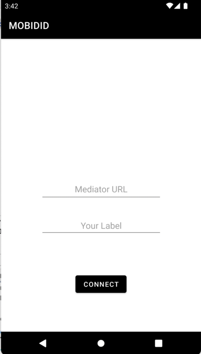

# Mobile Client
This is the Android mobile client for mobile messaging using DIDComm. It can be used together with 
the [mediator](https://git.snet.tu-berlin.de/blockchain/idunion/DID) to send DIDComm messages with other agents. 

The project uses Aries-framework-go for all DIDComm interactions. 
The framework file is built from this [Fork](https://github.com/bfrech/aries-framework-go/tree/main) 
of the original framework. 


## Configuration and Run Instructions
The mobile client can be tested with a local mediator. To start the mediator locally, follow the 
instructions in the [mediator repository](https://git.snet.tu-berlin.de/blockchain/idunion/DID).

### Prerequisites
- [AndroidStudio](https://developer.android.com/studio?hl=de&gclid=Cj0KCQjwmdGYBhDRARIsABmSEeOGXZey335Gg2o6yIng6QLyaY2Ev43k-JmaucP8QpeuHZZv98G84b4aAmySEALw_wcB&gclsrc=aw.ds)
- Android SDK
- Android NDK
- [ngrok](https://ngrok.com/)


### Run the Application on an Emulator in Android Studio
Since the Android agent cannot make a HTTP request to the mediator via localhost, use ngrok to provide
an address for the mediator. 
The mediator serves an endpoint on port 5000. Run:
```
ngrok http 5000
```


The app was successfully tested on: 
- Pixel XL API 31
- Pixel 3a XL API 30
- Pixel 4a API 30
- Pixel 5 API 31
- Nexus 6P API 31


## Usage
The first screen after startup will look like this:



The ngrok mediator URL and a label have to be entered. After a click on the 'Connect'
button, the app will create a new Aries agent and connect to the mediator. 


The second screen shows a list of connected mobile agents. It will be empty on the first startup.
To create a new connection invitation, click on the plus symbol, to scan a connection invitation 
click on the camera symbol.


This is how a new connection Invitation is displayed. This has to be scanned in the other mobile client.
To test this with two emulator:
- Make a screenshot of the invitation in Client A.
- Add the image to the virtual environment of client B: On emulator select 'More'. This 
  opens the extended settings. 
  Choose Camera and add the screenshot of the QR Code to the Virtual Scene. See [here](https://developers.google.com/ar/develop/java/emulator#add_augmented_images_to_the_scene) for mor information on virtual scene usage.
- In client B click on camera symbol on the contacts screen. Scan the QR Code.
- The mobile clients will then connect.

On click of the contact, this screen will open:


## Aries-framework-go
The project includes Aries-framework-go as a dependency for all DIDComm and Aries interactions. 
The framework file is built from the Fork of the repository at [https://github.com/bfrech/aries-framework-go/tree/main](). 

### How to build the framework file
To include changes to the framework code in the application.

Prerequisites:
- Golang >= 1.16
- Android SDK
- Android NDK
- Gomobile

To build the framework file install [gomobile](https://pkg.go.dev/golang.org/x/mobile/cmd/gomobile), 
and set the environment variables `ANDROID_HOME` and `ANDROID_NDK_HOME`.

Then run the following command in the `cmd/aries-agent-mobile` directory of the framework:
```
gomobile bind -v -ldflags '-s -w' -target=android/arm64,android/amd64 -javapkg=org.hyperledger.aries -o=./build/android/aries-agent.aar github.com/hyperledger/aries-framework-go/cmd/aries-agent-mobile/...
```
This creates the `aries-agent.aar` file that can be included in the [libs](app/libs) folder and 
referenced in the [build.gradle](app/build.gradle) file of the project.

Also see [here](https://github.com/hyperledger/aries-framework-go/blob/main/cmd/aries-agent-mobile/README.md)
for mor information on how to use the mobile bindings. 